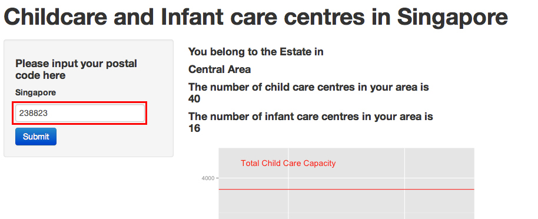

## Objective
The aim of this application is to help parents in Singapore. Singapore being a small and highly populated country, many parents here faced the problem of finding a child care and/or infant centre for their child(ren). To ensure good quality care for children, the size of children intake for child care and infant care centres are small. 

Luckily, the Government has done much to help parents in this area. The datasets used in this project are obtained from Singapore Government's website www.data.gov.sg and I highly encourage people to explore this site.

---

## Dataset
The data used in this project can be found in the site 
http://data.gov.sg/Metadata/SGMatadata.aspx?id=0608070000000013937A&mid=111824&t=TEXTUAL. 

The data used contains the enrollment statistics for the child care and infant care centres broken down by districts.

---

## How to use
The idea behind designing this site is to make it easy to use for the user. All the user has to do is to input their current postal code and submit.

That's all to it.

---

## Possible Future Developments

It would be very useful to parents if the locations of the centres are displayed on a map. A future development would be to include a map that pinpoints the child care and infant care centres within a certain radius of the postal code being searched. The parent could input the search radius of interest and retreive the full contact details of the centres within that radius.

